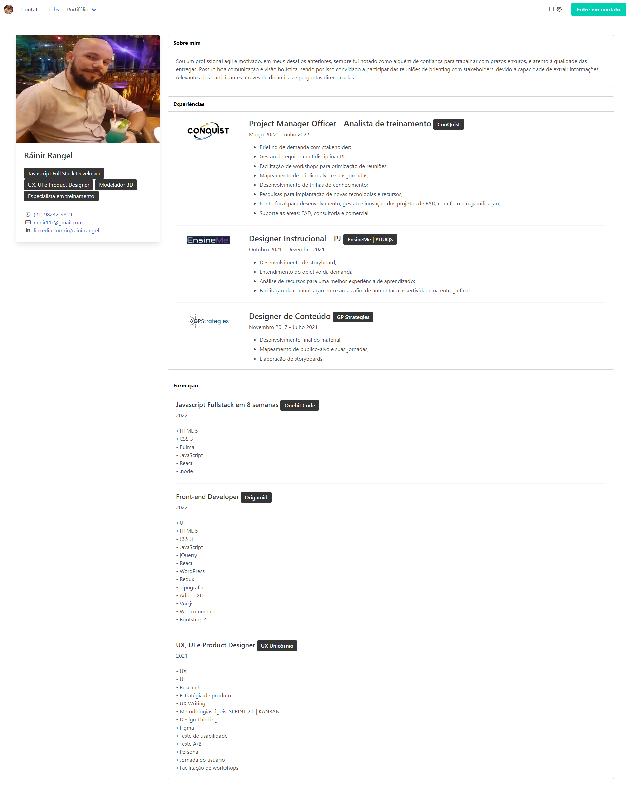

# Ráinir Rangel

> Curriculum

I used this project to study and try out new things, please give me a feedback to improve my skills.

The base for this project is developed in course "Programador Full Stack JavaScript em 8 semanas" of OneBitCode.

The intention for the checkbox on navbar is make a toogle for darkmode, this toogle, submit of form and jobs page is deployed soon.

[🔗 Click here to access](https://rainiryoshi.github.io/rainir-rangel-curriculum/)

## Technologies

- HTML
- CSS
- Bulma
- Git e Github

## 💻 Contact

rainir11r@gmail.com